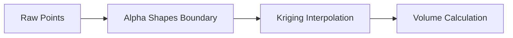
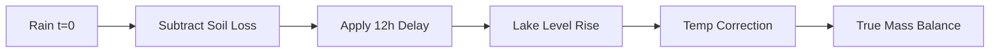

# FluxGen R&D Internship Assignment - Visual Guide

Here is a quick visual breakdown of the logic I used to solve the three problems in `FluxGen_Round1_Assignment.txt`.

## Problem 1: The Incomplete Geometry
**The Logic:**
Since the reservoir is natural, we can't assume simple shapes. I used Alpha Shapes to hug the actual data points and Kriging to intelligently guess the depths in the blind spots based on nearby trends.

## Problem 2: The Spectral Discrepancy
**The Logic:**
Satellites can be tricked by sun glint or mud. This flow checks for those "false positives" before we panic and send an alert.

## Problem 3: The Balancing Act
**The Logic:**
Water doesn't teleport, and it expands when hot. This model accounts for the delay (routing) and the thermal expansion so our "Digital Twin" doesn't see a ghost flood.

